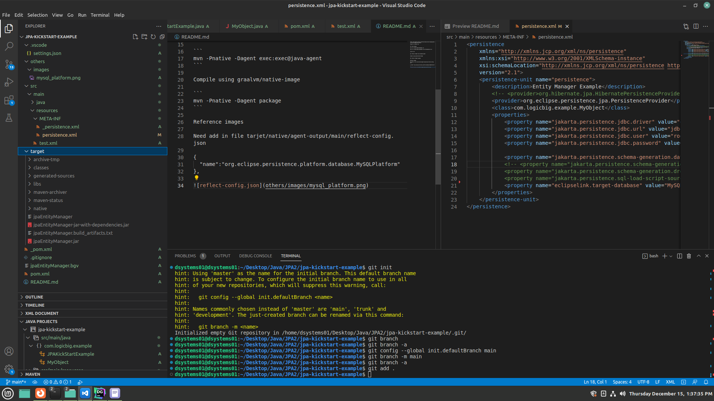
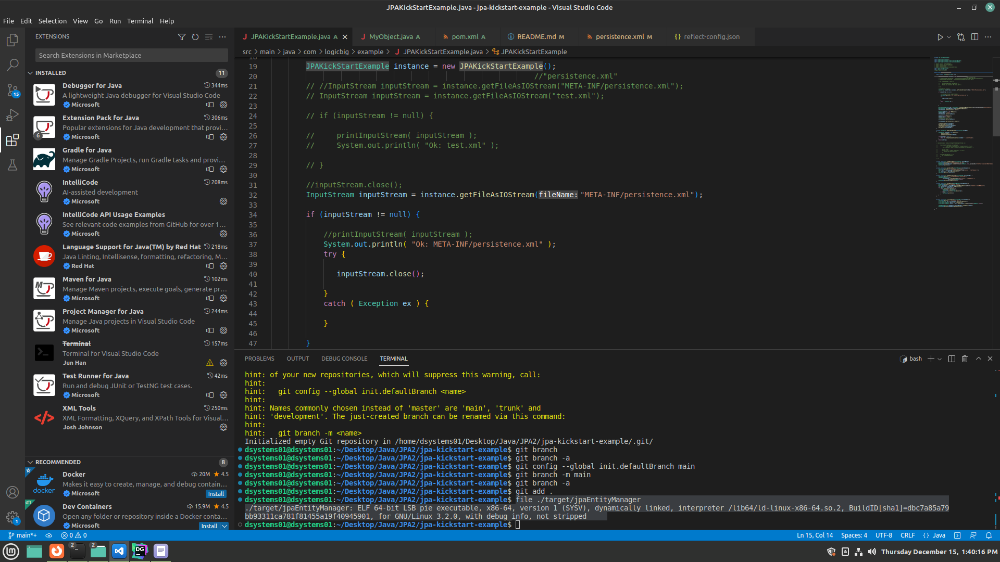
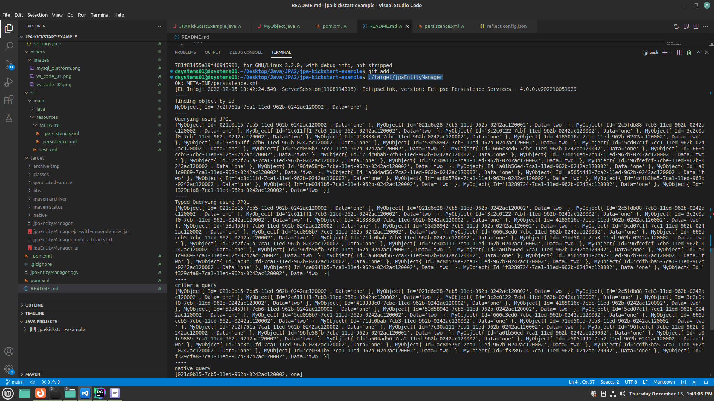
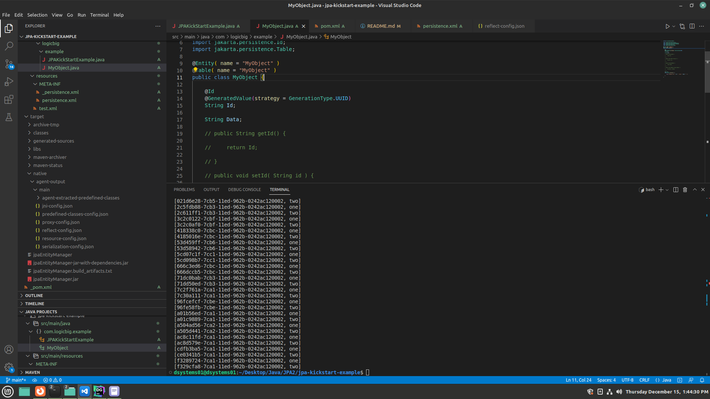
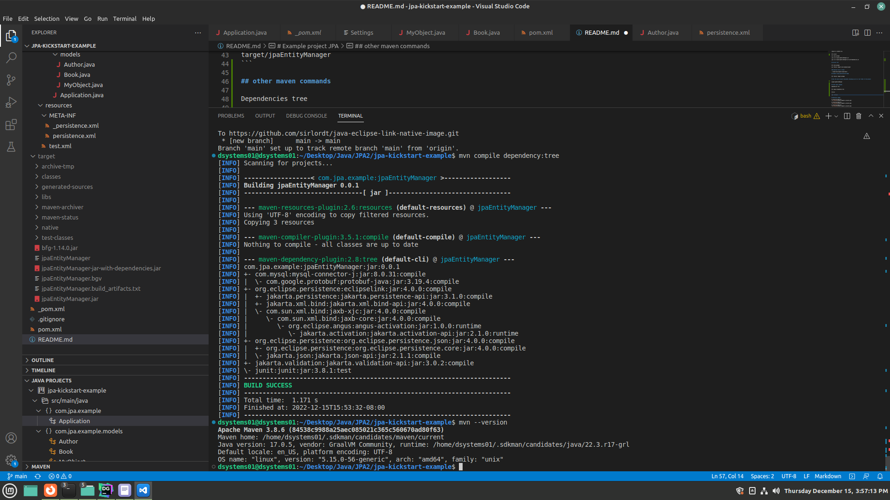
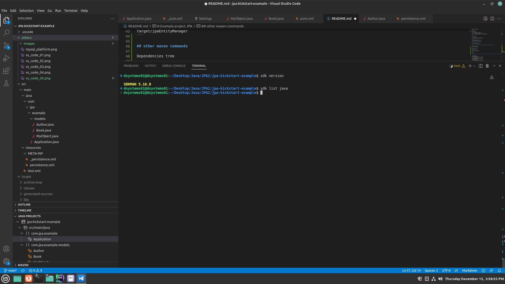
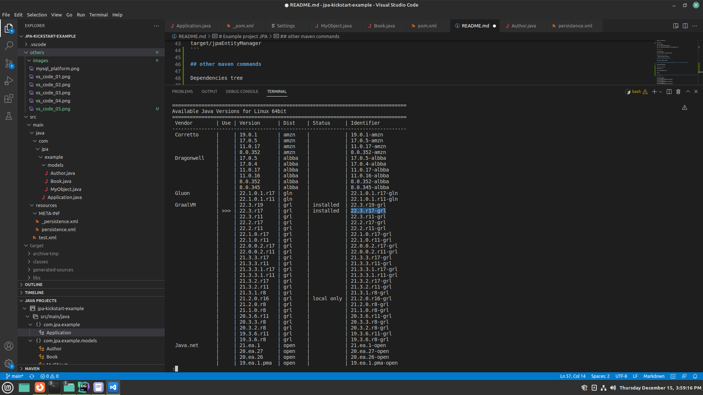
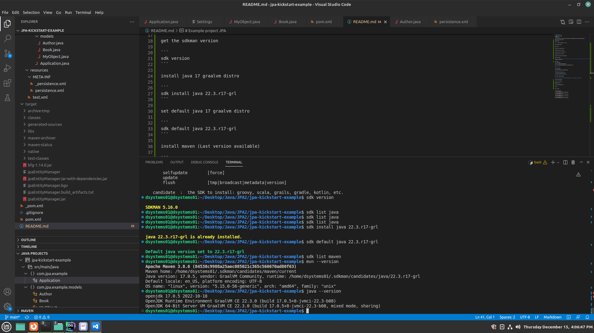

# Example project JPA

* GraalVM/Native Image
* ORM
* Eclipse Link

https://www.graalvm.org/22.2/reference-manual/native-image/guides/use-native-image-maven-plugin/

Please before install sdkman

sdkman install (sometimes later of install your need close and open your terminal or full vscode restart to sdk command can reconigzed)

```
curl -s "https://get.sdkman.io" | bash
```

get the sdkman version

```
sdk version
```

install java 17 graalvm distro

```
sdk install java 22.3.r17-grl
```

set default java 17 graalvm distro

```
sdk default java 22.3.r17-grl
```

install maven (Last version available)

```
sdk install maven
```

Compile to standard jvm.

```
mvn install

mvn clean package

java -jar target/jpaEntityManager.jar

java -jar target/jpaEntityManager-jar-with-dependencies.jar
```

## Collect info

```
mvn clean package

mvn -Pnative -Dagent exec:exec@java-agent
```

### Generate files in folder 

> target/native/agent-output/main/

## Compile using graalvm/native-image

```
mvn -Pnative -Dagent package
```

## Run the native project executable (Assuming you are in root folder of the project)

```
target/jpaEntityManager
```

## other maven commands

Dependencies tree

```
mvn compile dependency:tree
```

Version

```
mvn --version
```

## Reference images

Vs Code Enviroment 01


Vs Code Enviroment 02


Vs Code Enviroment 03


Vs Code Enviroment 04


Vs Code Enviroment 05


Vs Code Enviroment 06


Vs Code Enviroment 07


Vs Code Enviroment 08

